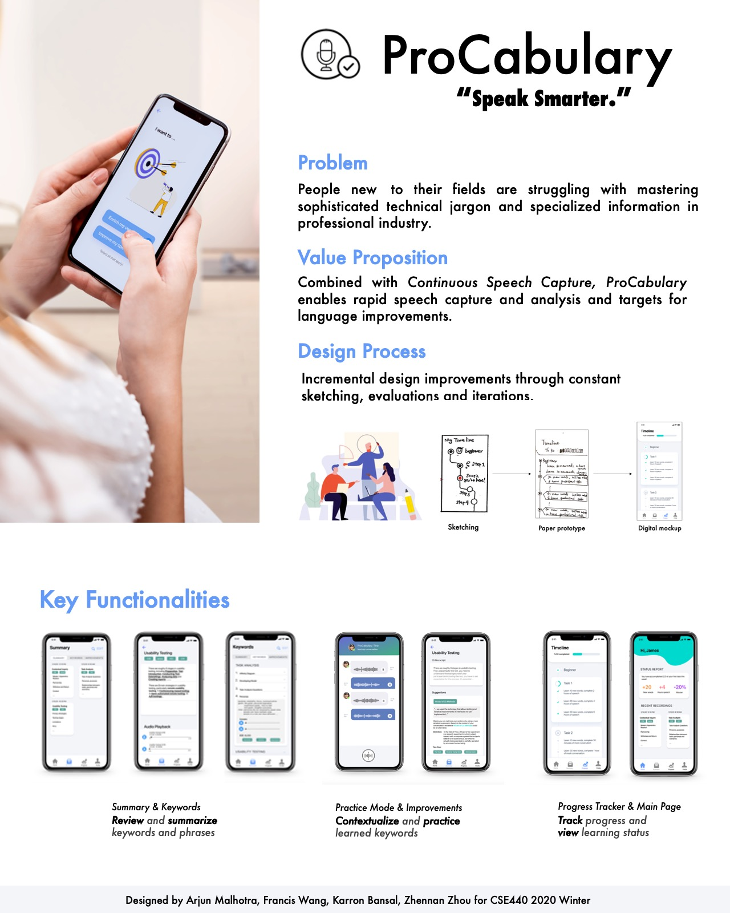

# ProCabulary 

ProCabulary is the HCI(Human Computer Interaction) project I participated in [CSE440](https://courses.cs.washington.edu/courses/cse440/20wi/) at University of Washington Paul G. Allen School of Computer Science and Engineering. In this project, we as a group examined problems people encounter in gathering and gaining value from personal data, then explored how a combination of design and machine intelligence can help go beyond simple data fetishes to help people in using personal data as part of reaching their goals.

The major theme in this offering is **self-tracking and everyday interaction with personal intelligences**.

The project in my group stemmed from and focused on *continuous speech capture*, a capability that is relatively feasible but still largely unexplored. After a fair amount of initial in-group discussions, we decided to focus on groups of people who are new to their professional industries and try to master their sophisticated and specialized jargons and information in professional industries at a quicker pace. By utilizing continuous speech capture technology, people can track their own speech as well as those of their colleagues to better understand technical jargon and integrate it into their own speech. 

Through our user research, including semi-structured interviews as well as surveys with our participants, we also identified and decided to support 2 primary tasks: 1) Easily record speech and review compiled words, phrases and summaries; 2) Improve vocabulary and speech through practice. These 2 tasks guided us through our design sketches as well as paper prototyping. 

We then conducted several testing processes, including Heuristic Evaluation with 3 of our potential target users, design critique with TAs as well as other groups during sections and 3 usability testings with another 3 potential target users. By performing testings, we compiled and gained enough feedback and suggestions for us to refine our design with our primary tasks in mind and design for our target users.

Finally, we transformed our paper prototype to digital mockups with key design principles in mind. In this process, we also made several necessary changes when considering the design patterns and guidelines on mobile platform.

More details can be found at: https://courses.cs.washington.edu/courses/cse440/20wi/projects/procabulary/

Also credit to: Arjun Malhotra, Karron Bansal and Francis Wang